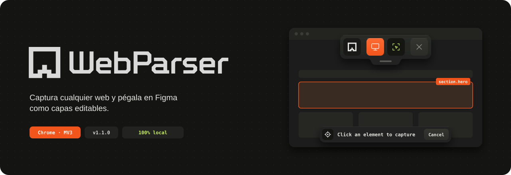
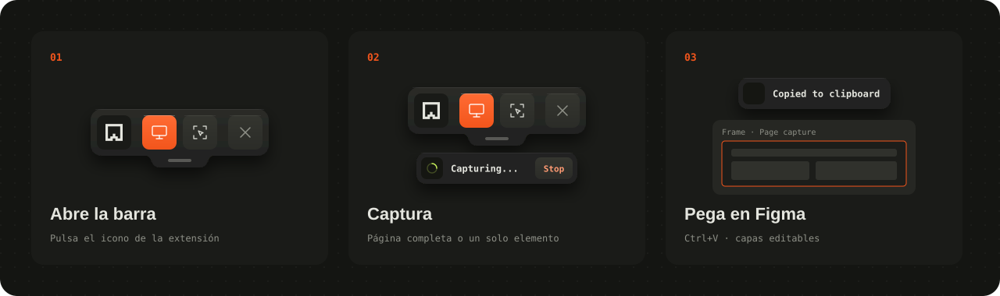
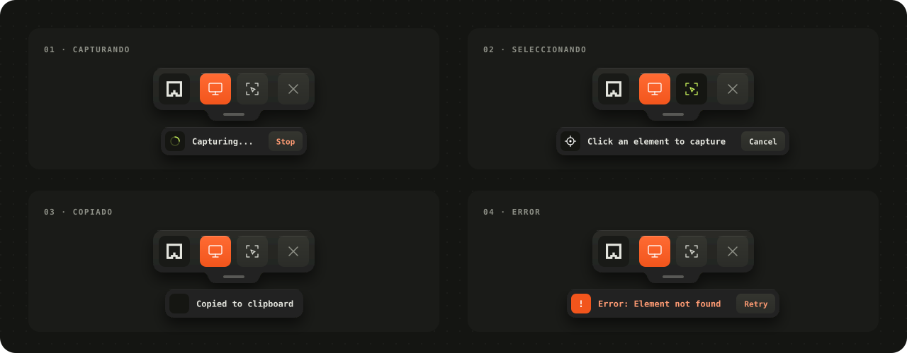

<p align="center">
  
</p>

# WebParser for Figma

## Que hace

**WebParser for Figma** es una extension de navegador que permite capturar sitios web completos o elementos individuales y transferirlos al canvas de **Figma** preservando la estructura visual, estilos, tipografias y recursos graficos.

Ideal para:
- **Disenadores** que necesitan auditar, prototipar o recrear interfaces existentes.
- **Desarrolladores** que quieren documentar componentes en Figma sin reconstruirlos manualmente.
- **Equipos** que migran disenos web legados a sistemas de diseno organizados.

---

## Como funciona

La extension opera en tres capas tecnicas:

### 1. Inyeccion y serializacion del DOM
Al activar la extension, se inyectan scripts de contenido (`capture.js` + `toolbar.js`) en la pestana activa. El motor de captura:
- Recorre el arbol DOM completo del documento.
- Extrae estilos computados (CSS), layouts (Flexbox, Grid), transformaciones y posiciones exactas.
- Serializa texto, imagenes, videos, canvas y SVGs en un formato intermedio estructurado.

### 2. Resolucion de recursos y bypass CORS
Las imagenes y videos cross-origin son capturados mediante un **bridge de extension** que funciona como proxy seguro:
- **Same-origin**: descarga directa + conversion a Base64.
- **Cross-origin**: el *service worker* (`background.js`) realiza el fetch por detras, evitando bloqueos CORS.
- **Fallback visual**: si un recurso no puede obtenerse, se genera un placeholder SVG proporcional para no romper el layout en Figma.

### 3. Pipeline de salida
Los datos serializados se codifican en un formato propietario compatible con el portapapeles de Figma:
- **Assets**: imagenes, videos y canvas se rasterizan a PNG.
- **Fuentes**: se detectan familias tipograficas y pesos utilizados.
- **Clipboard**: el payload se envuelve en un blob HTML especial (`<!--(figh2d)-->`) que Figma reconoce nativamente al pegar (`Ctrl+V` / `Cmd+V`).

---

## Instalacion

### Chrome / Edge / Brave (Manifest V3)

1. Descomprime el archivo descargado, **no la borres.**
2. Abre tu navegador y ve a `extensiones`.
3. Activa el **Modo desarrollador** (esquina superior derecha).
4. Haz clic en **"Cargar descomprimida"** y selecciona la carpeta del proyecto.
5. La extension aparecera en tu barra de herramientas.

---

## Uso

<p align="center">
  
</p>

1. Navega a la pagina web que deseas capturar.
2. Haz clic en el icono de **WebParser for Figma** en la barra de extensiones.
3. Aparecera una barra flotante con dos opciones:
   - **Entire screen** (tecla naranja): captura la pagina completa.
   - **Select element**: activa el modo de seleccion para capturar un solo elemento (hover + clic).
4. Espera a que el proceso termine. El mensaje *"Copied to clipboard"* confirmara que esta listo.
5. Abre **Figma**, selecciona el canvas y pega (`Ctrl+V` / `Cmd+V`).
6. La pagina aparecera como un grupo de capas vectoriales y rasterizadas, listas para editar.

**Detalles de la barra:**
- **Moverla:** arrastra desde la pestaña inferior (la pildora). El resto de la barra no se arrastra, para evitar movimientos accidentales.
- **Cancelar:** *Stop* durante una captura, o *Cancel* / `Esc` en el modo seleccion. No se copia nada y la barra sigue abierta.
- **Sigue abierta** despues de cada captura para que puedas hacer otra. Se cierra con el boton de cerrar, con `Esc` o tras 3 minutos sin usarla.
- **El logo** abre este repositorio en GitHub.

### Estados de la barra

<p align="center">
  
</p>

---

## Privacidad y Seguridad

Esta extension fue disenada bajo principios de **privacidad radical** y **procesamiento local**:

- **Sin servidores propios:** todo el procesamiento ocurre en tu navegador. No existe un "backend" de la extension.
- **Sin telemetria ni tracking:** no se envian analytics, logs ni datos de uso a terceros.
- **Permisos minimos:** `activeTab` y `scripting` para inyectar el motor de captura en la pestana activa, y acceso a sitios (`host_permissions`) solo para descargar las imagenes de otros dominios que aparecen en la pagina capturada.
- **Datos solo en Figma:** el payload viaja directamente al portapapeles de tu sistema. Tu decides donde pegarlo.
- **Codigo abierto:** puedes auditar cada linea de codigo. No hay logica oculta.

---

## Arquitectura del proyecto

```
webparser-for-figma/
|-- manifest.json          # Configuracion de la extension (MV3)
|-- background.js          # Service worker / proxy CORS
|-- capture.js             # Motor de serializacion DOM y recursos
|-- toolbar.js             # UI flotante (interfaz de usuario)
|-- assets/
|   |-- icon-*.png         # Iconos de la extension
|-- docs/
|   |-- *.svg              # Visuales del README
|   |-- brand/             # Logotipo, isotipo e icono
```

### Tecnologias clave
- **JavaScript vanilla** (ES6+ modules transpilados)
- **Web APIs:** `DOMMatrix`, `DOMQuad`, `AbortController`, `ClipboardItem`, `getComputedStyle`
- **Chrome Extension APIs:** `scripting`, `runtime`, `action`
- **Formato de salida:** JSON estructurado + blob HTML compatible con Figma

---

## Licencia

Distribuido bajo la licencia **MIT**. Eres libre de usar, modificar, distribuir y comercializar este software, siempre que se incluya la atribucion original.

```
MIT License

Copyright (c) 2026 jotadsgnr

Permission is hereby granted, free of charge, to any person obtaining a copy
of this software and associated documentation files (the "Software"), to deal
in the Software without restriction, including without limitation the rights
to use, copy, modify, merge, publish, distribute, sublicense, and/or sell
copies of the Software, and to permit persons to whom the Software is
furnished to do so, subject to the following conditions:

The above copyright notice and this permission notice shall be included in all
copies or substantial portions of the Software.
```